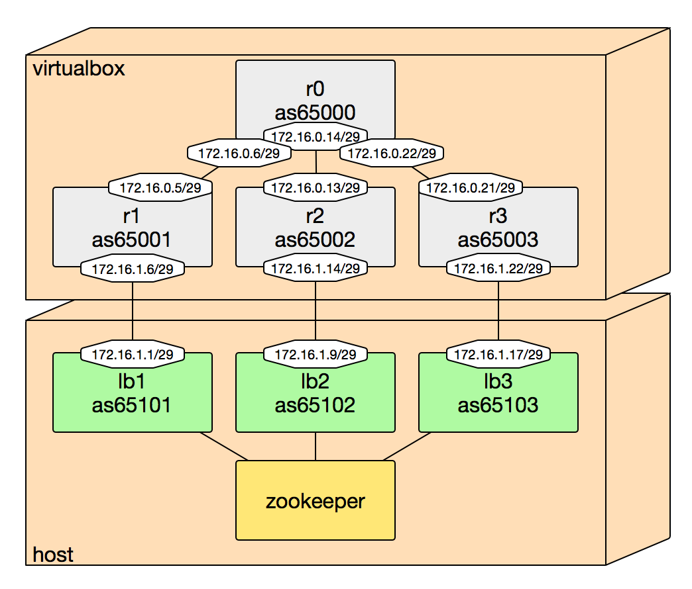

# Intro

This program is to be used as a process for exabgp. It will announce some VIP depending on the state of the VIP in ZooKeeper.

More precisely, it will inconditionnaly announce the VIP it is authoritative for, and will also announce the non-authoritative VIPs if they aren't announced by another instance.

The idea is to a make a service highly available in a network topology using eBGP to route the traffic to the correct path. In this example, we'll use a service named 'apex', and defined in the DNS with 3 VIPs.

This service is provided by a pool of web-servers, and 3 load-balancers. These load-balancers are connected to BGP capable ToR switches. In a nominal situation, each LB announces only 1 VIP, the authoritative one, and writes this to a ZK cluster as an ephemeral node. 

If a LB goes down, the ephemeral node for its authoritative VIP will disappear, and the other LBs will catch it. They'll announce these VIP in turn. As soon as the faulty LB comes back in ZK, the other LB will stop to announce its auth VIP.

A special node, named *maintenance*, is also watched, and if present, the route will be withdrawn. A local check (with a local command) will trigger the same withdrawal too (as exabgp-healthcheck does)

# Installation

This tool uses virtualenv and python 2.7. Please do:

    $ mkvirtualenv exazk
    $ workon exazk
    $ pip install -r requirements.txt

# Run

## testing

Running exazk outside of exabgp (for testing purpose):

    ./exazk.py -f conf/apex-node1.yml

is equivalent to:

    ./exazk.py -sF daemon -c /usr/local/bin/check_local_nginx.sh -n apex -A 10.20.255.1 -N 10.20.255.2 -N 10.20.255.3 -zH localhost -zPS /exabgp/service/apex -zPM /exabgp/maintenance/apex/node1

## inside ExaBGP

Running exazk inside exabgp:

    process exazk-apex {
        run /Users/remi/github/exazk/exazk.py -sF daemon -c /usr/local/bin/check_local_nginx.sh -n apex -A 10.20.255.1 -N 10.20.255.2 -N 10.20.255.3 -zH localhost -zPS /exabgp/service/apex -zPM /exabgp/maintenance/apex/node1;
    }

# Tests 

We provide a Vagrantfile to launch 3 VMs. These VM run quagga and are provisionned to be full-mesh interconnected.

One can then launch 3 instances of exabgp + exazk, each one connected to a particular quagga instance, and see how exazk is working.

This testsuite uses vagrant + ansible for provisionning. You'll also need a ZK instance too, obviously.

    $ cd tests && vagrant up
    $ vagrant ssh r1 -- vtysh # <= connect to the 1st quagga instance

